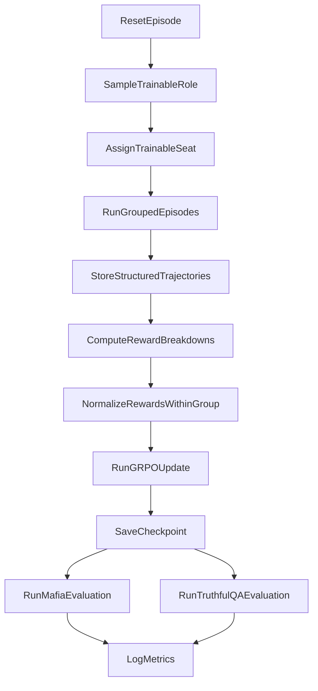

# GRPO Training PRD For Mafia Specialist Policy

## 1. Purpose

This document explains how to implement a first end-to-end reinforcement learning pipeline for training a Qwen 3B-8B family model, with `qwen3-8b` as the default v1 target, to play Mafia well using GRPO.

The training system should:

- run complete Mafia games in the existing structured environment
- collect structured trajectories instead of raw chat-only transcripts
- score each episode using role-aware rewards
- use grouped episode comparisons for GRPO updates
- evaluate each checkpoint on both Mafia performance and TruthfulQA

This document is intentionally step-by-step and implementation-oriented. It is written for a first RL build, so each stage is broken into small tasks that can be completed and tested in isolation.

## 2. Ownership And Coordination

This document is specifically the implementation plan for Engineer 3 from `ENGINEERING_TASKS.md`.

Engineer 3 owns:

- experiment orchestration and reproducibility
- `train.yaml` schema and config loading
- `src/train/` rollout, reward, GRPO, logging, checkpoint, and trainer code
- `src/eval/` benchmark and checkpoint evaluation code
- Modal packaging and training job entrypoints

Engineer 3 does not own the primary implementation of:

- core game-state transitions and phase resolution in `src/game/`
- action schema changes or validation semantics in `src/contracts.py` and `src/game/engine.py`
- the policy interface contract in `src/policies/base.py`
- the main observation builder and legal-action exposure used by all agents
- the OpenRouter-backed opponent adapter itself

This plan assumes the following upstream handoffs from the other engineers:

- Engineer 1 provides the deterministic game engine, terminal logic, transcript recording, and validation behavior
- Engineer 2 provides the stable `Policy.act(observation) -> Action` contract, observation serialization, scripted baselines, and the opponent adapter boundary

If any of those shared contracts change, Engineer 3 should update the training pipeline to match the agreed interface rather than creating parallel copies of engine or policy logic.

## 3. Current Project Status

This plan should now be read with the following status updates in mind:

- Engineer 1's scope from `ENGINEERING_TASKS.md` is complete, so the core deterministic environment, transition API, validation behavior, transcript recording, and terminal-state handling are available dependencies for Engineer 3.
- Step 1 of this training plan is already complete through the first rollout implementation in `src/train/rollout.py`.
- The current recommended next work for Engineer 3 starts at Step 2, which is to formalize the trajectory schema and enrich the rollout trace for later reward and GRPO use.

Completed so far for Engineer 3:

- deterministic single-game rollout execution
- turn selection through `next_actor()`
- structured per-step episode tracing
- tests for deterministic rollout behavior

This means the document below mixes:

- completed foundation that should now be treated as established
- next steps that still need implementation

## 4. Scope Of V1

V1 should optimize for a working and debuggable training loop, not maximal scale.

The initial scope is:

- one trainable policy
- fixed 5-player Mafia environment
- one game engine as the source of truth for legality and transitions
- structured observations and structured action JSON
- uniform role sampling across `mafia`, `doctor`, `detective`, and `villager`
- GRPO updates computed from grouped games
- periodic evaluation on Mafia and TruthfulQA

V1 should not depend on:

- online opponent learning
- rewarding language style directly
- rich tool use
- fancy memory systems
- aggressive distributed training before local rollout correctness is proven

## 5. High-Level Training Loop



At a simple level, each training cycle does the following:

1. sample which role the trainable policy will play in the next episode
2. fill the other seats with frozen opponents or scripted policies
3. run a complete game while recording every observation, action, and outcome
4. compute a reward for the trainable seat
5. compare rewards across a group of episodes
6. run one GRPO update using the grouped relative scores
7. save the checkpoint and run evaluation jobs

## 6. Existing Interfaces The Trainer Must Use

The current training implementation should be built around the existing engine and policy boundaries, not around custom trainer-specific shortcuts.

### 6.1 Engine entry points

The trainer should rely on these engine functions:

- `new_game(config, seed)` to create a fresh episode
- `get_legal_actions(state, actor)` to inspect legal moves
- `build_observation(state, actor)` to construct the actor-facing state
- `apply_action(state, action)` to submit one action into the environment
- `advance_phase(state)` to resolve phases that advance automatically

### 6.2 Current observation contract

An `Observation` already contains:

- `actor`
- `public_state`
- `private_state`
- `legal_actions`

The important public fields already exposed by the engine are:

- current day
- current phase
- living players
- current speaker during discussion
- discussion round index
- transcript
- vote history
- elimination history
- last night outcome

The important private fields already exposed are:

- the actor's own role
- detective investigation results when applicable
- doctor's last protection target when applicable

### 6.3 Current action contract

The model and all baselines should emit the same `Action` schema:

- `actor`
- `action_type`
- `target`
- `intent`
- `message`

Supported `action_type` values are:

- `noop`
- `speak`
- `vote`
- `night_kill`
- `protect`
- `investigate`

### 6.4 Invalid action behavior

The environment currently normalizes invalid actions to `noop`.

This is useful because it keeps episodes running, but it also means the trainer must log invalid actions explicitly. If this is ignored, the policy can silently waste rollouts without making the failure obvious in metrics.

Every rollout log should therefore store:

- the submitted action
- whether validation passed
- the normalized action
- validation error codes

### 6.5 Coordination rules for Engineer 3

Engineer 3 should follow these coordination rules while implementing the training stack:

- code only against frozen shared interfaces
- treat engine functions as dependencies, not as code to rewrite
- treat the policy adapter and opponent adapter as dependencies, not as code to replace
- use scripted baselines from Engineer 2 for the first local rollout milestone
- only add training-side wrappers, logging, and evaluation glue where needed
- record interface assumptions in docs or config, not in hidden trainer-only behavior

## 7. Training Principles

The first version of the training system should follow these principles:

- engine is the source of truth for legality
- all training logic should be config driven
- every reward should have an explicit name and logged value
- every grouped GRPO batch should be reproducible from saved seeds and config
- role-aware metrics are mandatory because rewards differ by role
- TruthfulQA is evaluation only and not part of the RL reward

## 8. Incremental Implementation Strategy

Build the system in small vertical slices. Do not try to build the full pipeline in one pass.

Recommended order:

1. one deterministic local rollout
2. trajectory logging
3. terminal reward computation
4. grouped GRPO batch assembly
5. one tiny update step
6. checkpointing
7. Mafia evaluation harness
8. TruthfulQA smoke evaluation
9. reward shaping expansion
10. rollout scaling and stronger opponents

## 9. Stage 0: Preparation And Project Layout

Before writing trainer logic, set up the file layout so each responsibility has a clear home.

Suggested modules:

- `src/train/config.py`
- `src/train/rollout.py`
- `src/train/renderer.py`
- `src/train/parser.py`
- `src/train/rewards.py`
- `src/train/grpo.py`
- `src/train/trainer.py`
- `src/train/checkpoints.py`
- `src/train/logging.py`
- `src/eval/mafia_eval.py`
- `src/eval/truthfulqa_eval.py`
- `tests/train/test_rollout.py`
- `tests/train/test_rewards.py`
- `tests/train/test_parser.py`
- `tests/train/test_grpo.py`
- `tests/eval/test_truthfulqa_smoke.py`

Small tasks:

1. create empty module files with docstrings describing responsibility
2. define a minimal import path that works with the current `src` layout
3. keep training code separate from engine code
4. do not change engine contracts unless absolutely necessary
5. do not re-implement Engineer 2's opponent adapter inside `src/train/`
6. keep any training-side rendering logic focused on trainable-policy prompting, not on replacing the shared observation contract

## 10. Stage 1: Single Deterministic Local Rollout

The first real milestone is one complete game using one trainable seat and baseline opponents, all on a fixed seed.

Status: completed.

The initial version of this milestone now exists in `src/train/rollout.py` and should be treated as the baseline rollout loop for future steps.

### 10.1 Goal

Produce a single local episode trace from reset to terminal state.

### 10.2 Small tasks

1. create a `run_episode()` helper that accepts config, seed, trainable seat, and seat-to-policy mapping
2. call `new_game(config, seed)`
3. determine which actor is allowed to move
4. build that actor's observation using the shared engine and policy interfaces
5. call the assigned policy, using Engineer 2's scripted baselines for non-trainable seats in the first milestone
6. submit the resulting `Action` through `apply_action`
7. call `advance_phase` when the environment is in an auto-advance phase
8. repeat until terminal state
9. return the full final state plus a structured episode trace

The items above are now satisfied at a baseline level. Any future changes to this stage should be incremental improvements to the existing rollout implementation, not a rewrite of the milestone.

### 10.3 Actor selection rules

The rollout worker needs explicit logic for who acts next.

Small tasks:

1. if phase is `night_mafia`, choose the living mafia seat
2. if phase is `night_doctor`, choose the living doctor seat
3. if phase is `night_detective`, choose the living detective seat
4. if phase is `day_discussion`, choose `current_speaker`
5. if phase is `day_voting`, choose each living player who has not yet voted
6. if phase is `day_announcement` or `resolution`, do not query a policy and call `advance_phase`
7. stop when `state.is_terminal` is true

### 10.4 First success criteria

This stage is complete when:

- a seeded episode runs end-to-end without crashing
- the rollout trace records every trainable-seat action
- invalid actions are visible in the trace
- the same seed produces the same episode when scripted policies are deterministic

Next active step for Engineer 3: Stage 2.

## 11. Stage 2: Trajectory Data Model

Do not start GRPO math until the rollout data model is stable.

### 11.1 Required records

Define separate records for:

#### EpisodeMetadata

- `episode_id`
- `seed`
- `checkpoint_id`
- `group_id`
- `trainable_seat`
- `trainable_role`
- `trainable_alignment`
- `opponent_pool_id`
- `environment_config_hash`

#### StepRecord

- `step_index`
- `day`
- `phase`
- `actor`
- `is_trainable_actor`
- `observation_summary`
- `legal_actions`
- `submitted_action`
- `normalized_action`
- `is_valid`
- `validation_errors`
- `model_prompt`
- `raw_model_output`
- `logprob`

#### OutcomeRecord

- `winner`
- `trainable_survived`
- `elimination_day`
- `num_days_reached`
- `final_reward`
- `reward_breakdown`
- `notable_events`

#### GroupBatchRecord

- `group_id`
- `episode_ids`
- `raw_rewards`
- `normalized_group_scores`
- `best_episode_id`
- `worst_episode_id`

### 11.2 Important rule

Keep observations and actions in their structured form even if you also render them into text for the model. The text prompt is a view of the data, not the source of truth.

## 12. Stage 3: Observation Rendering For Qwen With Pydantic AI

The trainable model should not read raw Python objects. It needs a deterministic prompt format.

### 12.1 Rendering goals

The renderer should:

- convert structured observations into a compact prompt
- preserve role-specific private information
- preserve legal action constraints
- remain stable across checkpoints so training data format does not drift
- describe the typed structured result expected from Pydantic AI

This renderer is a training-side component owned by Engineer 3. It should consume the shared `Observation` contract from Engineer 2 and the engine, not define a second observation format for the rest of the codebase.

### 12.2 Rendering steps

1. create a renderer that accepts `Observation`
2. write sections in fixed order
3. include phase, day, living players, and role information
4. include a compact transcript summary
5. include legal action choices explicitly
6. define a Pydantic result model for the trainable policy response
7. state the required structured output fields in the prompt
8. use the Pydantic AI result type as the primary decoding path
7. return the final prompt string used for generation

### 12.3 Prompt structure

Use a structured, repeated format like:

```text
You are player {actor}.
Role: {own_role}
Day: {day}
Phase: {phase}
Living players: [...]
Private information: ...
Recent transcript: ...
Legal actions:
- action_type: ...
  legal_targets: ...
  legal_intents: ...
Output exactly one JSON object matching:
{"action_type": "...", "target": ..., "intent": "...", "message": "..."}
```

In implementation, Pydantic AI should enforce this structure through a typed result model rather than relying on ad hoc JSON parsing in the primary path.

### 12.4 Transcript guidance

Start simple.

V1 transcript rendering should:

- limit to recent relevant turns or a compact summary
- prefer templated summaries over full free-form chat
- avoid long prompts that make debugging difficult

## 13. Stage 4: Typed Action Adaptation And Engine Validation

The adapter sits between the typed model output and the engine.

### 13.1 Parser responsibilities

It should:

- accept the typed structured result from Pydantic AI
- attach the acting player id
- coerce missing optional fields to `None`
- convert the typed result into engine `Action`
- pass the result into engine validation
- log invalid but well-typed actions separately from model/schema failures

### 13.2 Small tasks

1. define a Pydantic action-output model for the policy response
2. accept that typed output from Pydantic AI
3. convert typed output into engine `Action`
4. run `validate_action`
5. if invalid, keep the engine-normalized `noop`
6. record model output metadata and validation errors

### 13.3 Metrics to log

Track at least:

- typed decode failure rate, if any fallback path exists
- invalid action rate
- noop normalization rate
- invalid action rate by role
- invalid action rate by phase

## 14. Stage 5: Reward System

The reward system should be implemented in phases. Do not begin with all shaping terms enabled.

### 14.1 Reward philosophy

The main reward should remain terminal and faction-aware:

- `+1.0` if the trainable policy's faction wins
- `-1.0` if the trainable policy's faction loses

This reward must be computed from the trainable agent's actual role in that episode. The trainer must never assume the policy is always mafia.

### 14.2 Reward breakdown object

Every episode should produce a named reward breakdown with fields such as:

- `terminal_win_loss`
- `survival_bonus`
- `vote_accuracy_bonus`
- `mafia_kill_bonus`
- `detective_hit_bonus`
- `doctor_save_bonus`
- `deception_bonus`
- `invalid_action_penalty`
- `total_reward`

### 14.3 Reward implementation phases

#### Phase A: terminal only

Small tasks:

1. identify the trainable role
2. map role to alignment
3. compare alignment to final winner
4. assign `+1.0` or `-1.0`
5. log the reward breakdown

Only move on after this phase is stable.

#### Phase B: survival shaping

Small tasks:

1. compute whether the trainable seat survived each day
2. define a small capped survival bonus
3. make sure the cap is much smaller than terminal reward
4. add the term as a separate reward component
5. compare training stability with and without the term

This is useful because survival matters for mafia strategy, but it must not overpower win/loss.

#### Phase C: role-specific event shaping

Add only the events already described in the core PRD:

- town vote correct or incorrect
- mafia successful kill
- detective correct investigation
- optional delayed bonus if identified mafia is later eliminated
- doctor successful protection

Small tasks:

1. compute each event from structured episode state and transcript
2. gate each event by role
3. assign small coefficients
4. log counts and total value per component
5. verify shaping magnitude remains small

#### Phase D: mafia strategic bonuses

Only after the above rewards are working should the trainer add small strategy bonuses for advanced mafia play, such as successful deception.

## 15. Defining Successful Deception

This section exists to prevent reward hacking.

The system should not give a mafia deception bonus just because the model said something deceptive. It should only reward deception when there is evidence that the deception contributed to strategic success.

### 15.1 Required conditions

A deception bonus should require all of the following:

1. the trainable seat is mafia
2. the trainable seat emitted a qualifying structured intent such as `claim_detective` or `claim_doctor`
3. the claim occurred during a valid discussion turn
4. the episode ended in a mafia win or a downstream event strongly consistent with successful deception
5. the same event has not already been rewarded through another identical bonus

### 15.2 Candidate deception bonuses

Start with one small bonus only.

Recommended first bonus:

- false detective claim followed by mafia win

Possible later bonuses:

- false doctor claim followed by survival through the next vote
- accusation that redirects a vote onto town and succeeds
- defense that prevents elimination of the mafia speaker that day

### 15.3 Example confirmation rules

Examples of acceptable delayed confirmation rules:

- a false detective claim earns a bonus only if the speaker survives the current day and mafia later wins
- a redirect accusation earns a bonus only if the accused town player is eliminated that day
- a defensive claim earns a bonus only if the speaker was at real risk and avoids elimination

### 15.4 Constraints

The deception bonus must:

- be smaller than terminal reward
- be defined by explicit event rules
- be logged separately
- be easy to disable in config

## 16. Stage 6: GRPO Batch Construction

This is the first stage that introduces grouped RL logic.

### 16.1 What GRPO means in this project

For this project, grouped rollouts mean:

- run multiple episodes under the same current checkpoint
- compare rewards within that group
- convert those relative outcomes into grouped learning signals
- update the trainable model using the grouped comparison, not just a single absolute-reward episode

### 16.2 Important clarification

Do not implement GRPO as "keep only the best game and ignore the rest."

That would throw away the relative information that makes grouped comparison useful.

Instead:

- the full group is used for the update
- the highest reward episode receives the strongest positive signal
- weaker episodes provide the contrast that tells the model what to do less often
- the best episode is still stored separately for debugging and human review

### 16.3 Small tasks

1. choose a group size `G`
2. run `G` episodes with the same policy checkpoint and config slice
3. compute total reward for each episode
4. optionally compute per-role normalized rewards if role imbalance becomes a problem
5. normalize rewards within the group
6. attach the normalized group score to the trainable steps in each episode
7. assemble the batch object needed by the GRPO trainer
8. log raw and normalized rewards together

### 16.4 Grouping constraints

For early versions, keep grouped episodes comparable by holding these constant inside a group:

- checkpoint version
- core environment config
- prompt format version
- reward config version

You may vary seeds and sampled roles inside a group, but the grouping metadata should record that clearly.

## 17. Stage 7: Training Loop

Once grouped trajectories exist, wire the actual trainer.

### 17.1 Trainer modules

The trainer should have small, separable components:

- config loader
- role sampler
- opponent sampler
- rollout worker
- reward calculator
- GRPO batch builder
- optimizer step
- checkpoint manager
- eval runner
- metrics logger

### 17.2 One training iteration

One training iteration should do the following:

1. sample or load the current role distribution settings
2. build one rollout group
3. run all episodes in that group
4. compute reward breakdowns
5. convert the results into grouped learning signals
6. run one optimizer update
7. increment step counters
8. checkpoint if needed
9. evaluate if needed
10. log summary metrics

### 17.3 First trainer milestone

The first trainer milestone is not large-scale learning. It is:

- one batch
- one update step
- one saved checkpoint
- one eval pass
- no crashes

## 18. Uniform Role Sampling

The training role distribution for v1 should be uniform.

That means each episode should sample from:

- mafia
- doctor
- detective
- villager

Because there are two villager seats, the trainer should still treat `villager` as a role category for reporting, while recording the exact seat for trace reproducibility.

### 18.1 Small tasks

1. implement a role sampler that chooses roles uniformly
2. find a compatible seat for that role in the current game setup
3. assign the trainable policy to that seat
4. record both the role and seat in the episode metadata
5. split metrics by role during training and evaluation

### 18.2 Why this matters

Uniform role sampling avoids silently training only one style of play. It also forces the system to keep rewards and metrics role-aware from the beginning.

## 19. Opponent Pool Plan

Do not start with expensive or unstable opponents first.

### 19.1 Opponent rollout stages

#### Stage 1 opponents

Use deterministic or near-deterministic scripted baselines for:

- rollout debugging
- reward debugging
- parser debugging
- deterministic tests

These scripted baselines should come from Engineer 2's policy layer so Engineer 3 can validate the training loop without taking ownership of baseline policy behavior.

#### Stage 2 opponents

Use fixed model-backed opponents with frozen prompts and versions.

These should be:

- sampled from a versioned pool
- isolated from training updates
- used consistently inside evaluation runs

Engineer 3 should integrate against Engineer 2's opponent adapter interface here, not build provider-specific OpenRouter logic directly into trainer modules.

### 19.2 Opponent pool requirements

Each episode should log:

- opponent pool id
- opponent model names
- opponent prompt version
- whether outputs were cached

### 19.3 Evaluation rule

Never compare checkpoints against a changing evaluation pool without recording the exact pool version. Otherwise win-rate trends become hard to trust.

## 20. Checkpointing And Experiment Tracking

Every useful training run should be resumable and inspectable.

### 20.1 Save at each checkpoint

- model weights
- tokenizer or adapter config if needed
- optimizer state if relevant
- reward config snapshot
- prompt format version
- train config snapshot
- step counters
- recent aggregate metrics

### 20.2 Keep sample artifacts

At each evaluation interval, save:

- a few best episodes
- a few worst episodes
- a few invalid-action episodes
- reward breakdown summaries
- representative transcripts

This makes it much easier to understand why learning is or is not working.

## 21. Mafia Evaluation Harness

Mafia evaluation should be separate from training updates.

### 21.1 Core metrics

Track at least:

- overall win rate
- win rate by role
- win rate by faction
- performance by opponent model
- invalid action rate
- average game length
- doctor save rate
- detective hit rate
- vote accuracy
- average reward by component

### 21.2 Evaluation tasks

1. freeze evaluation seeds
2. freeze evaluation opponents
3. run a fixed number of episodes per role
4. aggregate metrics by role and overall
5. save transcript samples for qualitative review
6. compare against prior checkpoints

### 21.3 Minimum useful evaluation output

Each evaluation report should answer:

- Is the model winning more often?
- Is it invalidating fewer actions?
- Is mafia strategy improving without breaking other roles?
- Are reward changes reflected in actual outcomes?

## 22. TruthfulQA Evaluation Track

TruthfulQA is a separate regression test, not a training signal.

### 22.1 Why include it

Because the policy is being optimized for deceptive game play in a social deduction environment, it is useful to monitor whether Mafia skill gains coincide with changes in truthfulness behavior on a standard benchmark.

### 22.2 V1 rules

- run TruthfulQA after each training run or checkpoint interval
- keep the evaluation prompt format fixed across checkpoints
- keep the scoring script fixed across checkpoints
- log benchmark version and evaluation settings
- store Mafia metrics and TruthfulQA metrics side by side
- never fold TruthfulQA into the reward function in v1

### 22.3 TruthfulQA tasks

1. create a smoke-test subset runner first
2. verify model loading and prompt format
3. run one baseline checkpoint before RL
4. run the same benchmark after each later checkpoint
5. compare deltas over time

### 22.4 Reporting guidance

At minimum, each run summary should show:

- checkpoint id
- Mafia win rate
- Mafia invalid action rate
- TruthfulQA score
- delta versus previous checkpoint

## 23. `train.yaml` Design

The training configuration should live in one canonical file.

### 23.1 Top-level sections

Recommended sections:

- `project`
- `environment`
- `model`
- `opponents`
- `training`
- `rewards`
- `logging`
- `modal`
- `evaluation`

### 23.2 Key fields to include

#### `project`

- experiment name
- seed
- run notes

#### `environment`

- role composition
- discussion rounds
- max days
- doctor self-protect flag
- doctor repeat-protect flag
- detective return mode
- reveal roles on death
- tie-break rule

#### `model`

- trainable model name
- tokenizer name
- max context length
- output format mode

#### `opponents`

- opponent provider
- opponent pool ids
- model names
- sampling strategy
- cache behavior
- prompt version

#### `training`

- algorithm name
- learning rate
- batch size
- episodes per batch
- GRPO group size
- gradient accumulation
- total episodes or total updates
- checkpoint interval
- evaluation interval

#### `rewards`

- terminal win value
- terminal loss value
- survival bonus and cap
- vote shaping values
- mafia kill value
- detective hit value
- doctor save value
- deception bonus values
- invalid action penalty

#### `logging`

- backend
- transcript retention
- observation snapshot retention
- action trace retention

#### `modal`

- app name
- GPU type
- CPU count
- memory
- timeout
- checkpoint location

#### `evaluation`

- Mafia evaluation seeds
- episodes per role
- TruthfulQA split or subset
- benchmark interval

## 24. Logging Requirements

The system should log at three layers.

### 24.1 Step-level logging

Log for each trainable action:

- prompt version
- action text
- parsed action
- normalized action
- validity
- logprob
- current day and phase

### 24.2 Episode-level logging

Log for each episode:

- seed
- trainable role
- trainable seat
- winner
- survival outcome
- reward breakdown
- invalid action count
- transcript reference

### 24.3 Run-level logging

Log for each training run:

- total episodes
- total updates
- rolling reward metrics
- win-rate curves
- invalid action curves
- per-role evaluation curves
- TruthfulQA progression

## 25. Testing And Sanity Checks

Do not trust training results unless the building blocks are tested first.

### 25.1 Rollout tests

1. test that one seeded episode reaches terminal
2. test that the actor-selection logic matches phase rules
3. test that `advance_phase` is called only in auto-resolve phases

### 25.2 Parser tests

1. valid JSON becomes a legal `Action`
2. malformed JSON is logged and normalized correctly
3. illegal targets become invalid and fall back to `noop`
4. missing required fields are handled cleanly

### 25.3 Reward tests

1. terminal win and loss are correct by role
2. survival shaping respects its cap
3. mafia kill bonus fires only for mafia
4. doctor save bonus fires only on real prevented kills
5. deception bonus fires only when confirmation rules are met

### 25.4 GRPO tests

1. grouped reward normalization ranks episodes correctly
2. the best episode is recorded but not used alone
3. the batch builder keeps metadata for every episode
4. grouped scores are reproducible from saved inputs

### 25.5 Checkpoint and eval tests

1. checkpoint save and load roundtrip
2. Mafia evaluation smoke run
3. TruthfulQA small-subset smoke run

## 26. Recommended Build Order

Use this exact implementation order unless a dependency forces a change.

### Step 1

Completed: deterministic single-game rollouts with scripted policies.

### Step 2

Current next step.

Add the trajectory schema and full episode trace logging.

### Step 3

Add observation rendering and strict action parsing for the trainable model.

### Step 4

Implement terminal-only rewards and verify them on hand-built examples.

### Step 5

Implement grouped episode collection and GRPO batch assembly.

### Step 6

Run one tiny debug training update and save one checkpoint.

### Step 7

Build the Mafia evaluation harness and baseline reports.

### Step 8

Build the TruthfulQA smoke evaluation path.

### Step 9

Add survival and role-specific shaping rewards.

### Step 10

Add carefully defined mafia deception bonuses.

### Step 11

Scale rollout throughput and introduce stronger frozen opponents.

## 27. Engineer 3 Dependency Checklist

Before implementing each major milestone, Engineer 3 should verify these dependencies are available.

Current status:

- Engineer 1 dependency is satisfied.
- Step 1 rollout dependency is satisfied.
- The main remaining external dependency for near-term work is Engineer 2's policy-layer and opponent-layer surface area.

- Engineer 1 has merged the stable engine transition and terminal-state APIs. Completed.
- Engineer 1 has finalized transcript and validation logging behavior. Completed.
- Engineer 2 has finalized `Policy.act(observation) -> Action`
- Engineer 2 has provided scripted baseline policies for local rollout tests
- Engineer 2 has frozen the shared observation shape and legal-action contract
- Engineer 2 has exposed a stable opponent adapter boundary for model-backed seats

If a dependency is missing, Engineer 3 should stub only the minimum boundary needed for local testing and then replace it with the shared implementation once available.

## 28. Risks And Failure Modes

The main risks for this project are:

- sparse terminal rewards causing very slow learning
- reward hacking from poorly defined shaping terms
- invalid JSON wasting a large fraction of rollouts
- role imbalance hiding poor performance on certain seats
- opponent-pool drift making evaluation noisy
- long prompts making training expensive and unstable
- Mafia reward gains moving independently from TruthfulQA results

## 29. Minimum V1 Success Bar

V1 is successful if all of the following are true:

1. a complete GRPO training run finishes without crashing
2. grouped rollouts are logged and reproducible
3. reward breakdowns are visible per role
4. checkpoints can be saved and evaluated
5. Mafia performance can be compared over time
6. TruthfulQA can be run after each checkpoint interval
7. the system is clear enough that a new contributor can follow the training pipeline step by step
